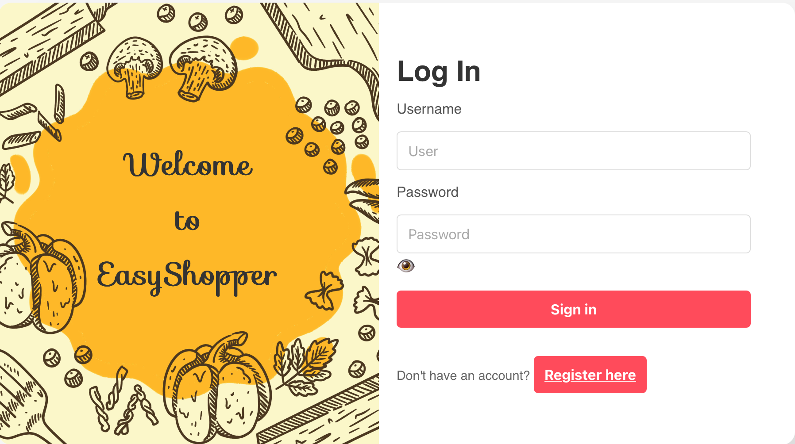
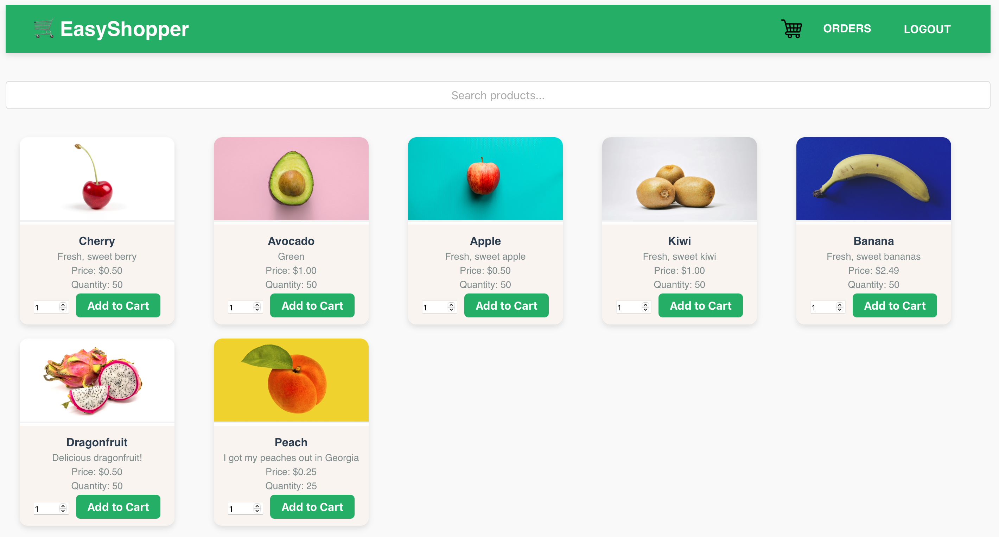
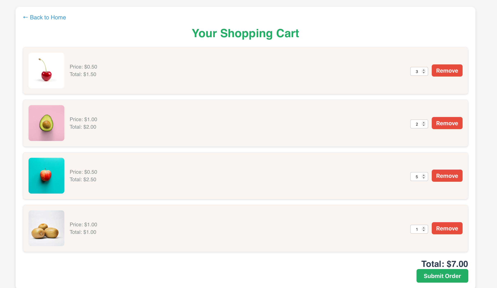
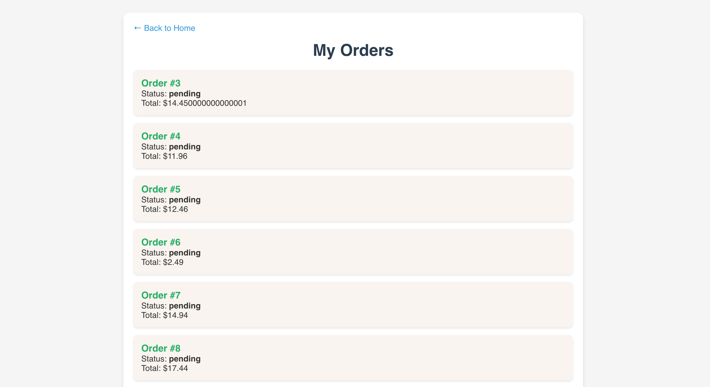
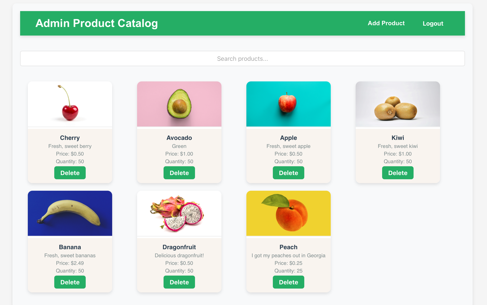
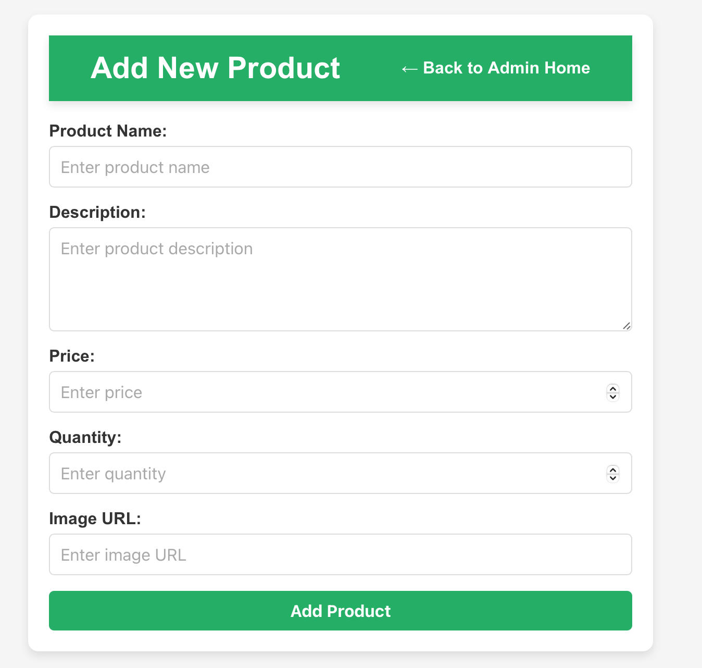

# 🛒 EasyShopper

A full-stack e-commerce web app built with **React**, **Node/Express**, and **PostgreSQL**.  
Deployed on **Netlify** (frontend) and **Render** (backend + DB).

> ⚙️ Status: Finalized v1.0 – this project is complete and serves as a portfolio piece.

---

## 🚀 Live Demo

**Frontend:** (https://easyshopper-app.netlify.app/)

---

## 🧠 Features

- User authentication (login/signup)
- Manager dashboard for adding/deleting products
- Persistent cart using `sessionStorage`
- Product search & filtering
- RESTful API integration
- Responsive, single-page routing with React Router
- Hosted PostgreSQL database (Render)

---

## 🧰 Tech Stack

**Frontend:** React, React Router, Fetch API  
**Backend:** Node.js, Express, pg (PostgreSQL)  
**Database:** PostgreSQL (Render)  
**Hosting:** Netlify (frontend), Render (backend)

---

## 🧩 Monorepo Structure

```
easy-shopper/
├── backend/ # Express + PostgreSQL API (entry: index.js)
└── frontend/ # React SPA
```

---

## ⚙️ Local Setup

### Backend

```bash
cd backend
cp .env.example .env
npm install
npm run dev
```

### Frontend

```bash
cd ../frontend
cp .env.example .env
npm install
npm start
```

Then open http://localhost:3000

---

## 💬 Reflection

EasyShopper began as a class project and grew into a complete full-stack app with real hosting and a working database.
Through it, I learned how to:

-Deploy full-stack apps using Render + Netlify

-Manage CORS, environment variables, and SSL

-Handle React Router in production builds

-Debug authentication and database issues

-Connect the dots between frontend UX and backend logic

It’s not a commercial product — it’s a proof of skill project demonstrating end-to-end execution.

---

## 🏷️ Versioning

Tagged as v1.0
To view: https://github.com/emosq369/easy-shopper/releases

---

## 📸 Screenshots

**Login**


**Home**


**Cart**


**Orders**


**Manager Dashboard**


**Add Product Page**


---

## 🎬 Demo

**Click the image to watch:**
[](https://youtu.be/keufUFrTSEw)

---

## 🤝 Acknowledgments

This project was developed collaboratively by **Eric Mosquera (@emosq369)** and **Benjy Flores (@Benf17)**  
as part of a full-stack course project.

EasyShopper wouldn’t exist without his effort and teamwork.

---

© 2024 Eric Mosquera & Benjy Flores
